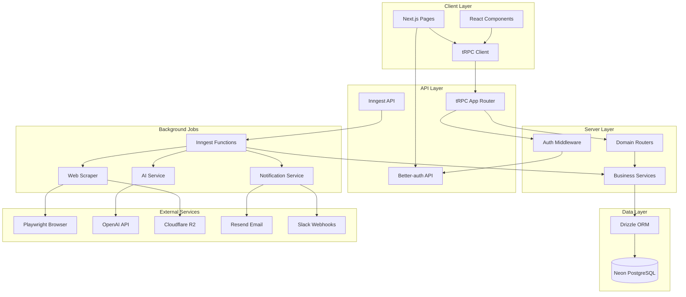
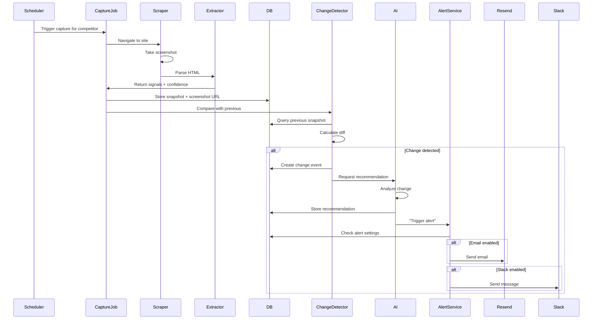

# OfferPulse Backend Implementation Plan

## Business Context

OfferPulse solves a critical pain point: **Shopify sellers don't know when competitors' offers change until it's too late**. The focus is on:

- **Offers** (free shipping, bundles, discounts, cart incentives) - not pricing/ads
- **Alert-first UX** (Email/Slack > dashboard)
- **Speed** ("Just changed" > "daily report")
- **Evidence** (before/after screenshots)
- **Opinionated suggestions** (actionable recommendations)

## Current State

- Frontend is fully wired but uses mock API (`[src/mock/api.ts](apps/app/src/mock/api.ts)`, `[src/mock/db.ts](apps/app/src/mock/db.ts)`)
- All data stored in localStorage
- Basic Prisma schema with only auth tables (`[prisma/schema.prisma](apps/app/prisma/schema.prisma)`)
- Custom cookie/localStorage auth (demo mode accepts any credentials)
- NO real backend, tRPC, API routes, or Better-auth implementation
- NO scraping or background job processing

## Tech Stack

- **Database**: Drizzle ORM + Neon PostgreSQL
- **API**: tRPC with superjson transformer
- **Auth**: Better-auth with email/password
- **Background Jobs**: Inngest (serverless-friendly, observability built-in)
- **AI**: OpenAI/Anthropic for recommendations
- **Scraping**: Playwright for browser automation
- **Storage**: Cloudflare R2 or AWS S3 for screenshots

## Migration Strategy

**Phased approach**: Database + tRPC setup first, then gradually add features

## Phase 1: Foundation & Database Migration

### 1.1 Remove Prisma, Setup Drizzle + Neon

**Remove**:

- `[apps/app/prisma/](apps/app/prisma/)` folder
- Prisma dependencies from `[apps/app/package.json](apps/app/package.json)`
- Prisma scripts (`db:generate`, `db:push`, etc.)

**Install**:

```bash
pnpm add drizzle-orm postgres
pnpm add -D drizzle-kit tsx dotenv
```

**Create structure**:

- `apps/app/src/server/db/schema.ts` - Drizzle schema (all tables)
- `apps/app/src/server/db/index.ts` - Database client
- `apps/app/drizzle.config.ts` - Drizzle configuration
- `apps/app/src/server/db/migrate.ts` - Migration runner

### 1.2 Database Schema Design

Based on `[src/mock/types.ts](apps/app/src/mock/types.ts)`, create comprehensive schema:

**Tables**:

1. **users** - User accounts (Better-auth will manage this)
2. **sessions** - User sessions (Better-auth)
3. **accounts** - OAuth accounts (Better-auth)
4. **workspaces** - Multi-tenant workspaces
5. **workspace_members** - Workspace membership + roles
6. **competitors** - Competitor details (domain, platform, tags, status)
7. **monitor_settings** - Per-competitor monitoring config (frequency, tracking toggles)
8. **snapshots** - Captured data from competitor sites
9. **extracted_signals** - Parsed offer data (promos, shipping, bundles, cart, delivery)
10. **change_events** - Detected changes with before/after
11. **recommendations** - AI-generated action items
12. **recommendation_checklist_items** - Task items for recommendations
13. **alert_settings** - Workspace notification preferences
14. **weekly_pulses** - Generated weekly summaries
15. **scrape_jobs** - Job tracking for Inngest

**Key Design Decisions**:

- Use `generated_always_as_identity()` for auto-incrementing IDs
- Proper foreign keys with cascade deletes
- Timestamps with `default(sql'now()')` and `.$onUpdate()`
- JSONB columns for flexible extracted signals
- Indexes on frequently queried fields (workspace_id, competitor_id, detected_at)

### 1.3 Setup Better-auth

**Install**:

```bash
pnpm add better-auth
pnpm add @better-auth/drizzle
```

**Create**:

- `apps/app/src/server/auth/index.ts` - Better-auth config
- `apps/app/src/server/auth/client.ts` - Client-side auth helpers
- `apps/app/src/server/auth/schema.ts` - Auth tables in Drizzle schema
- `apps/app/app/api/auth/[...all]/route.ts` - Auth API route handler

**Auth Features**:

- Email/password authentication
- Session management
- Password reset flow
- Email verification (optional for MVP)

**Remove**:

- `[src/lib/auth-helpers.ts](apps/app/src/lib/auth-helpers.ts)`
- Custom auth logic from `[src/mock/api.ts](apps/app/src/mock/api.ts)`
- Custom middleware auth checks

**Update**:

- `[middleware.ts](apps/app/middleware.ts)` - Use Better-auth session validation

### 1.4 Setup tRPC

**Install**:

```bash
pnpm add @trpc/server @trpc/client @trpc/next @trpc/react-query
pnpm add superjson
```

**Create structure**:

- `apps/app/src/server/trpc/trpc.ts` - tRPC instance with context and middleware
- `apps/app/src/server/trpc/routers/` - Domain routers
- `apps/app/src/server/trpc/routers/_app.ts` - Root app router
- `apps/app/src/lib/trpc/server.ts` - Server-side tRPC caller
- `apps/app/src/lib/trpc/client.ts` - Client-side tRPC client
- `apps/app/app/api/trpc/[trpc]/route.ts` - tRPC API route handler
- `apps/app/src/providers/trpc-provider.tsx` - React Query + tRPC provider

**tRPC Context**:

- Database client
- Better-auth session
- Current user
- Current workspace

**Middleware**:

- `publicProcedure` - No auth required
- `protectedProcedure` - Requires authentication
- `workspaceProcedure` - Requires workspace membership

**Router Structure** (based on mock API):

- `auth` - Login, signup, logout, session
- `competitors` - CRUD operations
- `monitorSettings` - Get/update monitoring config
- `snapshots` - List, get, capture
- `changeEvents` - List with filters, get detail
- `recommendations` - List, update status, update checklist
- `alerts` - Get/update alert settings, test notifications
- `weeklyPulse` - List, get by week
- `users` - Workspace members (invite, remove, update role)
- `workspaceSettings` - Get/update defaults

## Phase 2: Backend Implementation

### 2.1 Implement tRPC Routers

For each router, translate mock API functions to real database queries using Drizzle:

**Example - Competitors Router** (`src/server/trpc/routers/competitors.ts`):

- `list` - Query competitors for current workspace
- `get` - Get single competitor with related data
- `create` - Validate input with Zod, insert competitor + monitor settings
- `update` - Update competitor fields
- `delete` - Cascade delete (competitor, settings, snapshots, changes, recommendations)
- `toggleStatus` - Pause/resume monitoring

**Key Implementation Details**:

- Use Zod for input validation (leverage `[src/mock/types.ts](apps/app/src/mock/types.ts)` for schema)
- Use Drizzle relational queries for efficient joins
- Return proper TypeScript types (export `inferProcedureOutput`)
- Implement pagination for list queries
- Add proper error handling with `TRPCError`

### 2.2 Replace Mock API with tRPC

**Update all page components** in `[app/(dashboard)/](apps/app/app/(dashboard)`/) to use tRPC:

- Replace `import { competitorsApi } from '@/src/mock/api'`
- Use `trpc.competitors.list.useQuery()` instead of React Query + mock API
- Use `trpc.competitors.create.useMutation()` for mutations
- Keep optimistic updates and invalidation patterns

**Remove**:

- `[src/mock/api.ts](apps/app/src/mock/api.ts)`
- `[src/mock/db.ts](apps/app/src/mock/db.ts)`
- `[src/mock/types.ts](apps/app/src/mock/types.ts)` (types now inferred from tRPC)

### 2.3 Update Authentication Flow

**Replace** auth pages:

- `[app/(auth)/login/page.tsx](apps/app/app/(auth)`/login/page.tsx) - Use Better-auth client
- `[app/(auth)/signup/page.tsx](apps/app/app/(auth)`/signup/page.tsx) - Use Better-auth client
- `[components/auth/login-form.tsx](apps/app/components/auth/login-form.tsx)` - Better-auth login
- `[components/auth/signup-form.tsx](apps/app/components/auth/signup-form.tsx)` - Better-auth signup

**Update**:

- `[middleware.ts](apps/app/middleware.ts)` - Better-auth session validation
- `[app/layout.tsx](apps/app/app/layout.tsx)` - Add Better-auth session provider
- `[components/providers/session-provider.tsx](apps/app/components/providers/session-provider.tsx)` - Better-auth context

## Phase 3: Web Scraping & Background Jobs

### 3.1 Setup Inngest

**Install**:

```bash
pnpm add inngest
```

**Create**:

- `apps/app/src/server/jobs/client.ts` - Inngest client
- `apps/app/src/server/jobs/functions/` - Job functions
- `apps/app/app/api/inngest/route.ts` - Inngest API handler

**Job Functions**:

1. `capture-snapshot` - Scrape competitor site, store data
2. `schedule-captures` - Cron job to queue captures based on frequency
3. `detect-changes` - Compare snapshots, create change events
4. `generate-recommendations` - AI-powered action items
5. `send-alerts` - Email/Slack notifications
6. `generate-weekly-pulse` - Weekly summary reports

### 3.2 Implement Web Scraping Service

**Install**:

```bash
pnpm add playwright
```

**Create**:

- `apps/app/src/server/services/scraper.ts` - Browser automation
- `apps/app/src/server/services/extractor.ts` - Parse offer signals
- `apps/app/src/server/services/screenshot.ts` - Capture + upload screenshots

**Scraper Logic**:

- Detect platform (Shopify vs other)
- Navigate to competitor site
- Extract offer signals:
  - Promo banners (discount %, codes)
  - Shipping thresholds
  - Bundle offers
  - Cart incentives
  - Delivery/returns info
- Take screenshots (full page + specific elements)
- Handle errors, retries, timeouts

**Extractor Logic**:

- Platform-specific selectors (Shopify has predictable structure)
- Fallback to generic selectors
- Use regex/NLP for text extraction
- Confidence scoring (low/medium/high)

### 3.3 Screenshot Storage

**Options**:

- Cloudflare R2 (cheapest, S3-compatible)
- AWS S3
- Vercel Blob (easy integration)

**Implementation**:

- Upload screenshots after capture
- Store URLs in `snapshots` table
- Signed URLs for secure access
- Lifecycle policies for old screenshots

### 3.4 Change Detection Algorithm

**Logic** (`src/server/services/change-detector.ts`):

- Compare current vs previous snapshot
- Detect changes in:
  - Promo text/codes
  - Discount percentages
  - Shipping thresholds
  - Bundle offers
  - Cart incentives
- Calculate confidence based on:
  - Number of changed fields
  - Magnitude of changes
  - Consistency across snapshots
- Create change event if threshold met

## Phase 4: AI & Alerts

### 4.1 AI-Powered Recommendations

**Install**:

```bash
pnpm add openai
# or
pnpm add @anthropic-ai/sdk
```

**Create**:

- `apps/app/src/server/services/ai.ts` - AI service
- `apps/app/src/server/prompts/recommendations.ts` - Prompt templates

**Recommendation Logic**:

- Input: Change event + competitor context + user's offers
- Output: Strategy (MATCH/COUNTER/IGNORE/TEST), rationale, checklist
- Prompt engineering:
  - Provide context about change
  - Ask for opinionated advice
  - Request specific action items
  - Score impact (1-10) and effort (1-10)

**Example Prompt Structure**:

```
Competitor: {name}
Change detected: {type}
Before: {before}
After: {after}

Your offers: {current_offers}

Provide recommendation:
1. Strategy (MATCH/COUNTER/IGNORE/TEST)
2. Rationale (why this strategy)
3. Action items (3-5 specific steps)
4. Impact score (1-10)
5. Effort score (1-10)
```

### 4.2 Email & Slack Alerts

**Install**:

```bash
pnpm add resend  # for email
pnpm add @slack/webhook  # for Slack
```

**Create**:

- `apps/app/src/server/services/notifications/email.ts` - Email sender
- `apps/app/src/server/services/notifications/slack.ts` - Slack sender
- `apps/app/src/server/services/notifications/templates/` - Email templates

**Alert Triggers**:

- New high-confidence change detected
- New recommendation created
- Competitor site unreachable
- Weekly pulse ready

**Email Templates**:

- Change alert (before/after, recommendation preview)
- Weekly pulse (summary stats, top changes, action items)
- Digest (configurable frequency)

**Alert-First UX** (core principle):

- Prioritize immediate notifications over dashboard
- Include actionable info in alert (not just "check dashboard")
- Link directly to relevant change/recommendation

### 4.3 Weekly Pulse Generation

**Logic** (`src/server/services/pulse-generator.ts`):

- Aggregate changes for past week
- Calculate totals by type
- Identify highlights (biggest changes, new competitors)
- Select top moves (highest impact)
- Include open recommendations
- Generate narrative summary (optional AI)

**Trigger**: Inngest cron job (Monday morning)

## Phase 5: Scheduler & Jobs

### 5.1 Monitoring Scheduler

**Inngest Function** (`schedule-captures`):

- Run every hour (cron: `0 * * * *`)
- Query active competitors
- Check monitor settings (frequency)
- Calculate next capture time
- Enqueue `capture-snapshot` jobs

**Frequency Logic**:

- `1h` - Capture every hour
- `6h` - Capture every 6 hours
- `daily` - Capture once per day (9am user timezone)

### 5.2 Capture Pipeline

**Job Flow**:

1. `capture-snapshot` - Scrape site, extract signals, store snapshot
2. `detect-changes` - Compare with previous, create change event if needed
3. `generate-recommendations` - AI analysis of change
4. `send-alerts` - Notify user based on alert settings

**Error Handling**:

- Retry with exponential backoff
- Alert on repeated failures
- Store error logs in `scrape_jobs` table
- Dashboard visibility into failed captures

## Phase 6: Production Polish

### 6.1 Environment Variables

**Update** `[.env.local.example](apps/app/.env.local.example)`:

```env
# Database
DATABASE_URL=postgresql://...

# Better-auth
BETTER_AUTH_SECRET=...
BETTER_AUTH_URL=http://localhost:3001

# Inngest
INNGEST_EVENT_KEY=...
INNGEST_SIGNING_KEY=...

# AI
OPENAI_API_KEY=...
# or ANTHROPIC_API_KEY=...

# Storage
R2_ACCOUNT_ID=...
R2_ACCESS_KEY_ID=...
R2_SECRET_ACCESS_KEY=...
R2_BUCKET_NAME=...

# Notifications
RESEND_API_KEY=...

# App URLs
NEXT_PUBLIC_MARKETING_APP_URL=http://localhost:3000
NEXT_PUBLIC_DASHBOARD_APP_URL=http://localhost:3001
```

### 6.2 Error Handling & Logging

**Create**:

- `apps/app/src/lib/logger.ts` - Structured logging
- Error boundaries in React components
- Sentry integration (optional)

**Patterns**:

- Catch and log all errors in tRPC procedures
- Use `TRPCError` with appropriate codes
- Log Inngest job failures
- Track scraping success rate

### 6.3 Testing Strategy

**Priority**:

1. tRPC integration tests (database interactions)
2. Scraping service tests (mocked browser)
3. Change detection logic tests
4. E2E tests for critical flows (optional)

### 6.4 Database Scripts

**Add to** `[package.json](apps/app/package.json)`:

```json
{
  "scripts": {
    "db:generate": "drizzle-kit generate",
    "db:migrate": "tsx src/server/db/migrate.ts",
    "db:migrate:prod": "NODE_ENV=production tsx src/server/db/migrate.ts",
    "db:push": "drizzle-kit push",
    "db:studio": "drizzle-kit studio",
    "db:seed": "tsx src/server/db/seed.ts"
  }
}
```

**Create seed file** (`src/server/db/seed.ts`):

- Create demo workspace
- Add sample competitors
- Generate sample snapshots/changes
- Useful for development

## Implementation Order

### Iteration 1: Foundation

- Remove Prisma, setup Drizzle + Neon
- Create comprehensive database schema
- Setup Better-auth
- Setup tRPC with routers
- Migrate auth pages to Better-auth

### Iteration 2: Core Backend

- Implement all tRPC routers (competitors, snapshots, changes, etc.)
- Replace mock API calls with tRPC in frontend
- Test CRUD operations end-to-end
- Workspace multi-tenancy

### Iteration 3: Scraping & Jobs

- Setup Inngest
- Implement web scraping service
- Screenshot capture + storage
- Change detection algorithm
- Monitoring scheduler

### Iteration 4: Intelligence

- AI recommendation generation
- Email alerts (Resend)
- Slack alerts
- Weekly pulse generation

### Iteration 5: Polish

- Error handling and logging
- Rate limiting (optional)
- Production environment setup
- Database seed for demo

## Key Files to Create

**Database**:

- `apps/app/drizzle.config.ts`
- `apps/app/src/server/db/schema.ts`
- `apps/app/src/server/db/index.ts`
- `apps/app/src/server/db/migrate.ts`
- `apps/app/src/server/db/seed.ts`

**Auth**:

- `apps/app/src/server/auth/index.ts`
- `apps/app/src/server/auth/client.ts`
- `apps/app/app/api/auth/[...all]/route.ts`

**tRPC**:

- `apps/app/src/server/trpc/trpc.ts`
- `apps/app/src/server/trpc/routers/_app.ts`
- `apps/app/src/server/trpc/routers/*.ts` (8-10 routers)
- `apps/app/src/lib/trpc/server.ts`
- `apps/app/src/lib/trpc/client.ts`
- `apps/app/src/providers/trpc-provider.tsx`
- `apps/app/app/api/trpc/[trpc]/route.ts`

**Jobs**:

- `apps/app/src/server/jobs/client.ts`
- `apps/app/src/server/jobs/functions/*.ts` (6+ functions)
- `apps/app/app/api/inngest/route.ts`

**Services**:

- `apps/app/src/server/services/scraper.ts`
- `apps/app/src/server/services/extractor.ts`
- `apps/app/src/server/services/screenshot.ts`
- `apps/app/src/server/services/change-detector.ts`
- `apps/app/src/server/services/ai.ts`
- `apps/app/src/server/services/notifications/email.ts`
- `apps/app/src/server/services/notifications/slack.ts`
- `apps/app/src/server/services/pulse-generator.ts`

## Architecture Diagram




## Data Flow: Capture to Alert




## Success Criteria

- All Prisma code removed, Drizzle fully operational
- Better-auth working (signup, login, logout, session)
- All mock API replaced with tRPC
- Real competitor monitoring with scheduled captures
- Screenshots stored and accessible
- Change detection creates events automatically
- AI generates recommendations
- Email/Slack alerts deliver within 5 minutes of change
- Weekly pulse generated automatically
- Frontend works identically to mock version (no UX regression)

## Notes

- **Alert-first UX**: Prioritize immediate notifications with actionable info
- **Speed matters**: Target <5 minute latency from change detection to alert
- **Evidence-driven**: Always include before/after screenshots
- **Opinionated**: AI should provide specific, confident recommendations
- **Gradual migration**: Test each phase thoroughly before moving to next
- **Preserve frontend**: Minimal changes to UI components during migration

