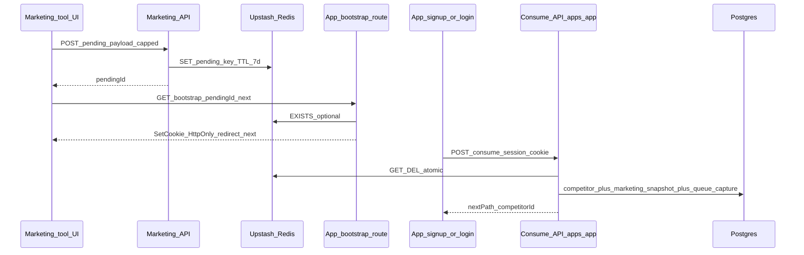

# Pending marketing snapshot to dashboard account

## Constraint: where consume runs

[`apps/app/src/server/auth/index.ts`](apps/app/src/server/auth/index.ts) `databaseHooks.user.create.after` only receives the new `user` row—**no HTTP Request**, so it **cannot** read an HttpOnly pending cookie. **Consume must run in a Route Handler or tRPC procedure** invoked from the client **after** `signUp` / `signIn` succeeds (cookies sent automatically), and for **Google OAuth** via a dedicated **`callbackURL`** page on the app that performs the same `fetch` before redirecting.

## Architecture (high level)

## 1. Redis contract (shared DB, two writers)

- **Key:** `pending:offer-snapshot:{nanoid}` (or similar prefix to avoid collisions with rate-limit keys in the same Redis).
- **Value:** JSON with at least: `competitorUrl` (normalized), `toolPayload` (capped subset of [`OfferSnapshotResponse`](apps/marketing/app/api/tools/offer-snapshot/route.ts)), `source` (e.g. `offer_snapshot_report`), optional UTM fields, `createdAt`.
- **TTL:** 7 days (`EX` / Upstash `set` with `ex`).
- **Payload cap:** enforce max serialized size (e.g. **256–512 KB**) in marketing before `SET`; reject with 413 if over; **no raw HTML** (only structured fields already returned by the tool).
- **Marketing:** extend existing Redis client in [`apps/marketing/lib/tools/rate-limit.ts`](apps/marketing/lib/tools/rate-limit.ts) (or sibling module) for pending writes.
- **App:** add `@upstash/redis` to [`apps/app/package.json`](apps/app/package.json), add `UPSTASH_REDIS_REST_URL` and `UPSTASH_REDIS_REST_TOKEN` to [`apps/app/env.ts`](apps/app/env.ts) and [`turbo.json`](turbo.json) `globalEnv` (mirror marketing entries).

## 2. HttpOnly cookie + signing

- **Cookie name:** e.g. `offerpulse_pending_snapshot` (single cookie).
- **Cookie value:** opaque token; **recommended:** `pendingId` + `.` + **HMAC-SHA256** of `pendingId` using a server secret (reuse `BETTER_AUTH_SECRET` or add `PENDING_SNAPSHOT_SECRET` in `env.ts` if you prefer separation). Verify on consume; reject tampered cookies.
- **Attributes:** `HttpOnly; Secure` in production; `Path=/; SameSite=Lax` (adjust if you ever need cross-site POST from marketing—top-level GET redirects are fine with Lax).
- **Production parent domain:** if marketing and app share `.offerpulse.com`, optional `Domain=.offerpulse.com` on the **app** bootstrap response so the cookie is visible on `app.offerpulse.com` (set from the app route only; avoids marketing needing the signing secret for cookie value if app always sets it).

## 3. Dev vs prod bootstrap (explicit)

- **Problem:** `localhost:3000` and `localhost:3001` do not share cookies.
- **Unified approach:** always finish with a **GET on the app origin** that sets the cookie:
  - After marketing `POST` creates `pendingId`, client navigates to  
    `{NEXT_PUBLIC_DASHBOARD_APP_URL}/api/onboarding/pending-bootstrap?pendingId=...&next=/signup`  
    where `next` is **allowlisted** (`/signup`, `/login` only) to prevent open redirects.
  - Route validates `pendingId` format + optional **Redis EXISTS** check, sets HttpOnly cookie, **302** to `next` (append safe query params like `competitorUrl` if you still want [`buildAppSignupUrl`](packages/lib/routing.ts) UX on the signup page without reading the cookie in JS).
- **Production:** same pattern (app sets cookie); marketing never needs to set cross-domain cookies directly.

## 4. Marketing UI changes

- [`apps/marketing/app/(marketing)/free-tools/offer-snapshot/tool/offer-snapshot-tool-client.tsx`](apps/marketing/app/(marketing)/free-tools/offer-snapshot/tool/offer-snapshot-tool-client.tsx): replace immediate `window.location.href = reportSignupUrl` on **Start monitoring** with:
  1. `POST /api/tools/offer-snapshot/pending` (new route) with **capped** JSON body from current `result`.
  2. On success, `window.location.href = pendingBootstrapUrl(pendingId, next=/signup)` as above (include existing UTM / PostHog params on final signup URL if desired).
- Add **short copy** near the CTA + link to privacy/terms per your compliance note ([`apps/marketing/app/(marketing)/terms/page.tsx`](apps/marketing/app/(marketing)/terms/page.tsx) already exists—surface a line in the tool/report UI).

## 5. App: consume API (authoritative provisioning)

- New route e.g. [`apps/app/app/api/onboarding/consume-pending-snapshot/route.ts`](apps/app/app/api/onboarding/consume-pending-snapshot/route.ts) `POST`:
  - Require session (Better Auth session helper / `auth.api.getSession` with request).
  - Read + verify cookie; **GET** Redis value; **delete key** (or use Lua / transaction pattern for consume-once).
  - Resolve **default workspace** (same approach as [`getDefaultWorkspaceId`](apps/app/src/server/workspace/get-default-workspace.ts) / session plugin).
  - **Idempotency:** if workspace already has a competitor for the same **domain/baseUrl**, skip duplicate create, still clear cookie+redis, return `{ consumed: false, reason: 'duplicate' }` or attach snapshot only per product choice—document default: **skip create, clear pending**.
  - Else: **create competitor** (reuse field derivation from [`apps/app/app/(dashboard)/onboarding/shopify/page.tsx`](apps/app/app/(dashboard)/onboarding/shopify/page.tsx) `completeOnboarding` URL→name/domain logic, or extract shared server helper under `apps/app/src/server/onboarding/`).
  - **Insert snapshot** row with `captureSource: 'marketing_tool'`, `screenshotUrl` from tool payload, and **`extractedSignals`** populated via a new mapper from aggregated offers to the existing [`extractedSignals`](apps/app/src/server/db/schema.ts) shape (minimum valid object + `confidence`—align with [`extractSignalsFromFirecrawl`](apps/app/src/server/scraping) expectations where UI reads it). Optionally store a **trimmed** `toolPayload` in `firecrawlJson` or a dedicated nullable `jsonb` column if you want strict separation—prefer **one extra nullable `marketingToolPayload` jsonb`** only if mapping into `firecrawlJson` feels wrong.
  - **Queue canonical capture:** `inngest.send({ name: 'competitor/capture', data: { competitorId, workspaceId } })` (same as [`snapshotsRouter.capture`](apps/app/src/server/trpc/routers/snapshots.ts)).
  - Clear cookie in response `Set-Cookie` (Max-Age=0).
  - Return JSON: `{ ok: true, competitorId, snapshotId?, next: '/competitors/{id}?welcome=1' }`.

## 6. Schema: `captureSource`

- In [`apps/app/src/server/db/schema.ts`](apps/app/src/server/db/schema.ts), add `captureSource` as `text` with **Drizzle `.default('product_capture')`** or a small `pgEnum` (`product_capture` | `marketing_tool`).
- Generate migration via `pnpm db:generate` from `apps/app`; migration SQL should **`UPDATE snapshots SET capture_source = 'product_capture' WHERE capture_source IS NULL`** then enforce `NOT NULL` if you start nullable for safety.
- Update all **insert** sites to set source explicitly where defaults are insufficient:
  - [`apps/app/src/server/jobs/functions/capture-snapshot.ts`](apps/app/src/server/jobs/functions/capture-snapshot.ts)
  - [`apps/app/src/server/jobs/functions/batch-capture-snapshots.ts`](apps/app/src/server/jobs/functions/batch-capture-snapshots.ts)
  - [`apps/app/src/server/db/seed.ts`](apps/app/src/server/db/seed.ts)
- New marketing snapshot insert in consume route uses `'marketing_tool'`.

## 7. Retire `localStorage` onboarding intent

- Remove usage from:
  - [`apps/app/app/(auth)/signup/page.tsx`](apps/app/app/(auth)/signup/page.tsx)
  - [`apps/app/app/(auth)/login/page.tsx`](apps/app/app/(auth)/login/page.tsx)
  - [`apps/app/app/(dashboard)/onboarding/shopify/page.tsx`](apps/app/app/(dashboard)/onboarding/shopify/page.tsx)
- In [`packages/lib/routing.ts`](packages/lib/routing.ts): **deprecate or delete** `storeOnboardingIntent`, `getOnboardingIntent`, `clearOnboardingIntent`, `OnboardingIntent`, and `STORAGE_KEYS.ONBOARDING_INTENT` (grep to ensure no remaining imports).
- Update [`docs/onboarding/CROSS_APP_ONBOARDING.md`](docs/onboarding/CROSS_APP_ONBOARDING.md) to describe Redis + cookie + consume API instead of localStorage intent.

## 8. Auth UX wiring

- **Email signup** ([`signup/page.tsx`](apps/app/app/(auth)/signup/page.tsx)): after successful `signUp.email`, `await fetch('/api/onboarding/consume-pending-snapshot', { method: 'POST', credentials: 'include' })`, then `router.push` based on JSON (`competitor` vs `/`).
- **Email login** ([`login/page.tsx`](apps/app/app/(auth)/login/page.tsx)): same optional consume (handles “signed up elsewhere / came back with cookie” edge case); then redirect.
- **Google** (`signIn.social` / `signUp` path): set `callbackURL` to a new client page e.g. [`apps/app/app/(auth)/auth/after-sign-in/page.tsx`](apps/app/app/(auth)/auth/after-sign-in/page.tsx) that runs consume once then `router.replace` to home or competitor URL from response. Register route in auth layout if needed so it is **authenticated** (session available).

## 9. `/onboarding/shopify` behavior

- Today it **hard-redirects** away if `!getOnboardingIntent()` ([`shopify/page.tsx`](apps/app/app/(dashboard)/onboarding/shopify/page.tsx)). After removing intent:
  - **Option A (recommended):** make the page **always accessible** to logged-in users (optional Shopify connect + Skip). Remove competitor provisioning from this page when it duplicates consume—**`completeOnboarding` should only run Shopify-specific steps** or delegate “ensure competitor” to shared helper that no-ops if competitor already exists.
  - **Option B:** stop linking signup to this page entirely when consume succeeds; keep page for manual `/onboarding/shopify` visits only.
- Align with your decision: **competitor + marketing snapshot must not depend on Shopify**—so provisioning moves to **consume API**; Shopify page becomes optional post-signup UX.

## 10. Security and abuse

- Rate-limit `POST` pending creation (reuse [`rateLimiter`](apps/marketing/lib/tools/rate-limit.ts) patterns).
- Validate URLs with existing Zod/shared validators.
- **Allowlist** `next` on bootstrap route.
- Log consume outcomes with [`logger`](packages/lib) (no full payload in logs).

## 11. Verification

- `pnpm type-check` / `pnpm lint` from repo root.
- Manual: marketing tool → pending → bootstrap on localhost:3001 → signup → competitor + two snapshots over time (marketing_tool immediately, `product_capture` when job completes).
