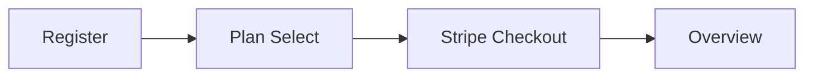
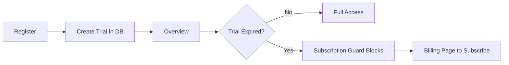

# Remove Signup Plan Step and Auto-Subscribe with 14-Day Trial

## Current Flow

Users must choose a plan and complete Stripe Checkout (payment method required) before accessing the dashboard.

## Target Flow

## Implementation

### 1. Schema: Support trial-only subscriptions

The `subscriptions` table currently requires `stripeCustomerId`, `stripeSubscriptionId`, and `stripePriceId` as NOT NULL. Trial-only subscriptions have no Stripe record.

**File:** [apps/app/src/server/db/schema.ts](apps/app/src/server/db/schema.ts)

- Make `stripeCustomerId`, `stripeSubscriptionId`, and `stripePriceId` nullable
- Run `pnpm db:generate` for the schema change; run the migration manually when ready

### 2. Create trial subscription in auth hook

**File:** [apps/app/src/server/auth/index.ts](apps/app/src/server/auth/index.ts)

In `databaseHooks.user.create.after`, after creating the workspace and membership:

- Insert a subscription row with:
  - `status: "trialing"`
  - `planId: "starter"`, `interval: "month"`
  - `stripeCustomerId`, `stripeSubscriptionId`, `stripePriceId`: `null`
  - `currentPeriodStart`, `currentPeriodEnd`, `trialStart`, `trialEnd`: now and now + 14 days
  - `cancelAtPeriodEnd: false`

Import `TRIAL_PERIOD_DAYS` from `@offerpulse/lib/pricing` and `subscriptions` from schema.

### 3. Simplify signup page

**File:** [apps/app/app/(auth)/signup/page.tsx](apps/app/app/(auth)/signup/page.tsx)

- Remove the `"plan"` step and all plan-selection UI (billing toggle, plan cards, CTA)
- Remove `selectedPlan`, `billingInterval`, `isCheckoutLoading`, `handleCheckout`
- Remove `Step` type and `step` state; keep only the register form
- **Email signup:** After `signUp.email` success, `router.push("/overview")` instead of `setStep("plan")`
- **Google signup:** Change `callbackURL` from `"/signup?step=plan"` to `"/overview"`
- Remove the `useEffect` that sets `step` from `?step=plan`
- Remove unused imports: `PRICING_PLANS`, `formatPrice`, `PricingPlan`, `useTRPCClient` (if no longer needed)

### 4. Treat expired trials as inactive

**File:** [apps/app/src/providers/subscription-provider.tsx](apps/app/src/providers/subscription-provider.tsx)

- Update `isActive`: require `currentPeriodEnd >= now` in addition to `status === "active" || status === "trialing"`
- Ensures the subscription guard blocks access when the trial has expired

### 5. Allow checkout when trial is expired

**File:** [apps/app/src/server/trpc/routers/billing.ts](apps/app/src/server/trpc/routers/billing.ts)

In `createCheckoutSession`:

- Change the existing-subscription check to block only when the subscription is active/trialing **and** `currentPeriodEnd >= now`
- If the user has an expired trial (`status === "trialing"` and `currentPeriodEnd < now`), allow checkout
- Before creating the Stripe session, optionally set the expired trial to `status: "canceled"` so the webhook upsert behaves correctly

### 6. Expire trial in DB when detected

**File:** [apps/app/src/server/trpc/routers/billing.ts](apps/app/src/server/trpc/routers/billing.ts)

In `getSubscription`:

- If the subscription has `status === "trialing"` and `currentPeriodEnd < now`, update it to `status: "canceled"` and return `null` (or the updated row, treated as inactive)

This keeps the DB consistent and allows `createCheckoutSession` to proceed when the user subscribes after an expired trial.

### 7. Billing page: trial-only handling

**File:** [apps/app/app/(dashboard)/settings/billing/page.tsx](apps/app/app/(dashboard)/settings/billing/page.tsx)

- For trial-only subscriptions (`!stripeCustomerId` or `!stripeSubscriptionId`): hide "Manage payment method" and "Cancel subscription"
- Show a primary "Subscribe to continue" or "Choose a plan" CTA that calls `createCheckoutSession` with a default plan (e.g. `starter_monthly`)
- `createPortalSession`, `cancelSubscription`, and `reactivateSubscription` use `subscribedProcedure` and assume Stripe IDs; they are not reachable for trial-only users if we hide those actions

### 8. Stripe webhook: upsert over trial

**File:** [apps/app/app/api/webhooks/stripe/route.ts](apps/app/app/api/webhooks/stripe/route.ts)

- `upsertSubscription` uses `onConflictDoUpdate` on `(userId)` where `status in ('active','trialing')`
- A trial row with `status: "trialing"` will conflict; the update will set Stripe fields
- Ensure `stripePriceId` can be set from `priceItem?.price.id` (no change needed if schema allows it)
- If the schema uses nullable Stripe fields, the upsert `set` clause must include them

### 9. Default plan for trial

Use the Starter plan (`planId: "starter"`) for the auto-created trial so limits (1 workspace, 5 competitors) match the lowest tier. Users can upgrade via the billing page after signup.

## Files to Modify

| File                                                 | Changes                                                             |
| ---------------------------------------------------- | ------------------------------------------------------------------- |
| `apps/app/src/server/db/schema.ts`                   | Nullable Stripe columns                                             |
| `apps/app/src/server/auth/index.ts`                  | Create trial subscription in user hook                              |
| `apps/app/app/(auth)/signup/page.tsx`                | Remove plan step, redirect to overview                              |
| `apps/app/src/providers/subscription-provider.tsx`   | Add `currentPeriodEnd` check to `isActive`                          |
| `apps/app/src/server/trpc/routers/billing.ts`        | Allow checkout for expired trial; expire trial in `getSubscription` |
| `apps/app/app/(dashboard)/settings/billing/page.tsx` | Hide Manage/Cancel for trial-only; show Subscribe CTA               |

## Migration

After schema changes: `cd apps/app && pnpm db:generate`. Run the migration manually when ready (e.g. `pnpm db:push` for local dev or `pnpm db:migrate:prod` for production).