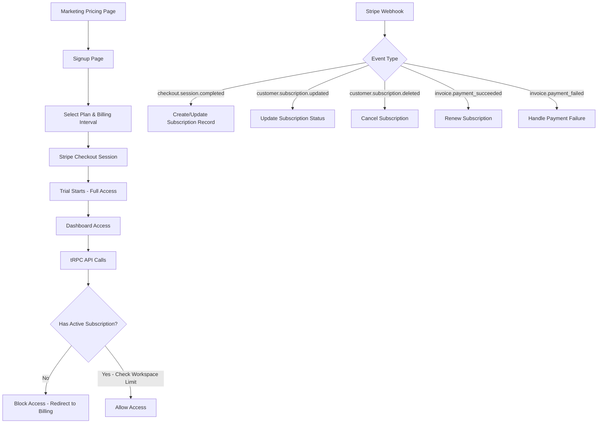

# Stripe Subscription Integration Plan

## Overview

Implement per-user Stripe subscriptions with a 14-day trial period (payment method required upfront), checkout during signup, and workspace limits based on plan tier. Use Stripe lookup keys for price management.

## Architecture

### Billing Model

- **Per-user billing**: Each user has one subscription
- **Workspace limits**:
  - Starter & Growth: 1 workspace maximum
  - Agency: 5 workspaces maximum
- **Trial**: Stripe-managed 14-day trial with payment method required
- **Access**: Full feature access during trial, enforce limits after expiration




## Implementation Steps

### 1. Database Schema Changes

**Update `[apps/app/src/server/db/schema.ts](apps/app/src/server/db/schema.ts)`**

Add new subscription-related tables and update the user table:

#### New `subscriptions` table:

```typescript
export const subscriptions = pgTable("subscriptions", {
  id: text("id").primaryKey(),
  userId: text("user_id").notNull().references(() => user.id, { onDelete: "cascade" }),
  stripeCustomerId: text("stripe_customer_id").notNull().unique(),
  stripeSubscriptionId: text("stripe_subscription_id").notNull().unique(),
  stripePriceId: text("stripe_price_id").notNull(),
  
  // Plan details (denormalized for quick access)
  planId: text("plan_id").notNull(), // "starter", "growth", "agency"
  interval: text("interval").notNull(), // "month" or "year"
  
  // Subscription status
  status: text("status").notNull(), // "active", "trialing", "past_due", "canceled", "incomplete"
  cancelAtPeriodEnd: boolean("cancel_at_period_end").notNull().default(false),
  
  // Billing periods
  currentPeriodStart: timestamp("current_period_start").notNull(),
  currentPeriodEnd: timestamp("current_period_end").notNull(),
  trialStart: timestamp("trial_start"),
  trialEnd: timestamp("trial_end"),
  canceledAt: timestamp("canceled_at"),
  
  // Timestamps
  createdAt: timestamp("created_at").defaultNow().notNull(),
  updatedAt: timestamp("updated_at").defaultNow().notNull().$onUpdate(() => new Date()),
});
```

#### Indexes for performance:

```typescript
index("subscriptions_user_idx").on(subscriptions.userId),
index("subscriptions_stripe_customer_idx").on(subscriptions.stripeCustomerId),
index("subscriptions_status_idx").on(subscriptions.status)
```

#### Relations:

```typescript
export const userRelations = relations(user, ({ one, many }) => ({
  subscription: one(subscriptions, {
    fields: [user.id],
    references: [subscriptions.userId],
  }),
  // ... existing relations
}));
```

### 2. Environment Configuration

**Update `[apps/app/env.ts](apps/app/env.ts)`**

Add Stripe environment variables:

```typescript
server: {
  STRIPE_SECRET_KEY: z.string().startsWith("sk_", "STRIPE_SECRET_KEY must start with sk_"),
  STRIPE_WEBHOOK_SECRET: z.string().startsWith("whsec_", "STRIPE_WEBHOOK_SECRET must start with whsec_"),
  // ... existing vars
},
client: {
  NEXT_PUBLIC_STRIPE_PUBLISHABLE_KEY: z.string().startsWith("pk_", "Must start with pk_"),
  // ... existing vars
}
```

**Update `[packages/lib/pricing.ts](packages/lib/pricing.ts)`**

Add lookup key fields to replace hardcoded price IDs:

```typescript
export interface PricingPlan {
  // ... existing fields
  stripeLookupKeyMonthly: string; // e.g., "starter_monthly"
  stripeLookupKeyYearly: string;  // e.g., "starter_yearly"
  maxWorkspaces: number; // 1 for starter/growth, 5 for agency
}

export const PRICING_PLANS: PricingPlan[] = [
  {
    id: "starter",
    stripeLookupKeyMonthly: "starter_monthly",
    stripeLookupKeyYearly: "starter_yearly",
    maxWorkspaces: 1,
    // ... existing fields
  },
  // ... other plans
];
```

**Update `[turbo.json](turbo.json)`**

Add Stripe env vars to `globalEnv` for Turborepo builds:

```json
"globalEnv": [
  "STRIPE_SECRET_KEY",
  "STRIPE_WEBHOOK_SECRET",
  "NEXT_PUBLIC_STRIPE_PUBLISHABLE_KEY",
  // ... existing vars
]
```

### 3. Enhanced Signup Flow with Plan Selection

**Create `[apps/app/app/(auth)/signup/page.tsx](apps/app/app/(auth)`/signup/page.tsx)**

Multi-step signup wizard:

1. Email/password registration
2. Plan selection (Starter/Growth/Agency)
3. Billing interval toggle (monthly/yearly)
4. Stripe Checkout redirect

Key implementation details:

- Fetch pricing plans from `@offerpulse/lib/pricing`
- Display plan comparison with features
- Billing interval toggle (show yearly savings)
- Pass `lookup_key` and user email to checkout API
- Handle "Start Free Trial" button (creates Stripe Checkout session)

**Create tRPC router: `[apps/app/src/server/trpc/routers/billing.ts](apps/app/src/server/trpc/routers/billing.ts)`**

```typescript
export const billingRouter = router({
  createCheckoutSession: protectedProcedure
    .input(z.object({
      lookupKey: z.string(),
      successUrl: z.string().url().optional(),
      cancelUrl: z.string().url().optional(),
    }))
    .mutation(async ({ ctx, input }) => {
      // Fetch price by lookup key
      const prices = await stripe.prices.list({
        lookup_keys: [input.lookupKey],
        limit: 1,
      });
      
      // Create Stripe checkout session with:
      // - mode: "subscription"
      // - subscription_data: { trial_period_days: 14 }
      // - customer_email: ctx.user.email
      // - metadata: { userId: ctx.user.id }
      
      return { sessionUrl };
    }),
});
```

### 4. Stripe Webhook Handler

**Create `[apps/app/app/api/webhooks/stripe/route.ts](apps/app/app/api/webhooks/stripe/route.ts)`**

Handle critical Stripe events:

#### Events to handle:

`**checkout.session.completed**`

- Extract `userId` from metadata
- Create customer if new (store `stripeCustomerId`)
- If subscription created, insert into `subscriptions` table
- Extract plan details from price metadata/lookup_key
- Status: "trialing" if trial_end exists, else "active"

`**customer.subscription.created**`

- Insert subscription record with trial dates

`**customer.subscription.updated**`

- Update subscription status, period dates
- Handle plan changes, trial ending, cancellations

`**customer.subscription.deleted**`

- Mark subscription as "canceled"
- Set `canceledAt` timestamp

`**invoice.payment_succeeded**`

- Update subscription status to "active"
- Update period dates (renewal)

`**invoice.payment_failed**`

- Update subscription status to "past_due"
- Send payment failure email via Resend
- Consider grace period logic

`**customer.subscription.trial_will_end**` (optional)

- Send reminder email 3 days before trial ends

#### Webhook verification:

```typescript
const event = stripe.webhooks.constructEvent(
  body,
  signature,
  env.STRIPE_WEBHOOK_SECRET
);
```

### 5. Subscription Protection Middleware

**Update `[apps/app/src/server/trpc/trpc.ts](apps/app/src/server/trpc/trpc.ts)`**

Create new `subscribedProcedure`:

```typescript
export const subscribedProcedure = protectedProcedure.use(async ({ ctx, next }) => {
  // Fetch user's subscription with status
  const subscription = await ctx.db.query.subscriptions.findFirst({
    where: eq(subscriptions.userId, ctx.user.id),
  });
  
  // Check if subscription is active or trialing
  if (!subscription || !["active", "trialing"].includes(subscription.status)) {
    throw new TRPCError({
      code: "PAYMENT_REQUIRED",
      message: "Active subscription required",
    });
  }
  
  // Check if trial/period is expired
  const now = new Date();
  if (subscription.currentPeriodEnd < now) {
    throw new TRPCError({
      code: "PAYMENT_REQUIRED",
      message: "Subscription expired. Please update billing.",
    });
  }
  
  return next({
    ctx: {
      ...ctx,
      subscription,
    },
  });
});
```

**Enhanced `workspaceProcedure`**:

Add workspace limit check:

```typescript
export const workspaceProcedure = subscribedProcedure.use(async ({ ctx, next, getRawInput }) => {
  // ... existing membership check
  
  // Check workspace count against plan limits
  const workspaceCount = await ctx.db
    .select({ count: count() })
    .from(workspaceMembers)
    .where(eq(workspaceMembers.userId, ctx.user.id));
  
  const plan = getPlanById(ctx.subscription.planId);
  if (workspaceCount[0].count >= plan.maxWorkspaces) {
    throw new TRPCError({
      code: "FORBIDDEN",
      message: `Your ${plan.name} plan allows ${plan.maxWorkspaces} workspace(s). Upgrade to access more.`,
    });
  }
  
  // ... continue with existing logic
});
```

### 6. Update All Protected Routes

**File: `[apps/app/src/server/trpc/routers/root.ts](apps/app/src/server/trpc/routers/root.ts)`**

Change all feature routers to use `subscribedProcedure` or `workspaceProcedure`:

- `competitors` router
- `monitorSettings` router
- `snapshots` router
- `changeEvents` router
- `recommendations` router
- `alerts` router
- `weeklyPulse` router

This ensures all dashboard features require an active subscription.

### 7. Billing Management Page

**Update `[apps/app/app/(dashboard)/settings/billing/page.tsx](apps/app/app/(dashboard)`/settings/billing/page.tsx)**

Replace mock implementation with real Stripe integration:

#### Features to implement:

**Current Subscription Display**

- Fetch subscription via tRPC: `trpc.billing.getSubscription.useQuery()`
- Show plan name, status badge (Active/Trialing/Past Due)
- Display billing interval (Monthly/Yearly)
- Show trial end date if trialing
- Display next billing date and amount

**Usage Stats**

- Keep existing competitor and snapshot counts
- Add workspace count with limit: "1/1 workspaces" or "2/5 workspaces"

**Cancel Subscription**

- Button to cancel at period end
- Show cancellation date
- Option to reactivate before period end

**Update Payment Method**

- Create Stripe billing portal session via tRPC
- Redirect to Stripe's hosted portal

**Change Plan**

- Display available plans with upgrade/downgrade options
- Create checkout session for plan changes
- Handle proration via Stripe

**tRPC procedures needed:**

```typescript
// apps/app/src/server/trpc/routers/billing.ts
export const billingRouter = router({
  getSubscription: subscribedProcedure.query(async ({ ctx }) => {
    // Return subscription with plan details
  }),
  
  createPortalSession: subscribedProcedure
    .input(z.object({ returnUrl: z.string().url() }))
    .mutation(async ({ ctx, input }) => {
      // Create Stripe billing portal session
      const session = await stripe.billingPortal.sessions.create({
        customer: ctx.subscription.stripeCustomerId,
        return_url: input.returnUrl,
      });
      return { url: session.url };
    }),
  
  cancelSubscription: subscribedProcedure
    .mutation(async ({ ctx }) => {
      // Cancel subscription at period end
      await stripe.subscriptions.update(
        ctx.subscription.stripeSubscriptionId,
        { cancel_at_period_end: true }
      );
    }),
  
  reactivateSubscription: subscribedProcedure
    .mutation(async ({ ctx }) => {
      // Remove cancellation
      await stripe.subscriptions.update(
        ctx.subscription.stripeSubscriptionId,
        { cancel_at_period_end: false }
      );
    }),
});
```

### 8. Workspace Creation Limits

**Update `[apps/app/src/server/auth/index.ts](apps/app/src/server/auth/index.ts)`**

Modify the `onCreate` hook to NOT auto-create workspace during signup. Instead:

- User completes Stripe checkout first
- Webhook creates subscription record
- Redirect to onboarding flow
- Onboarding creates first workspace (verified against subscription limit)

**Create workspace creation procedure:**

```typescript
// apps/app/src/server/trpc/routers/workspaces.ts
export const workspacesRouter = router({
  create: subscribedProcedure
    .input(z.object({ name: z.string(), slug: z.string() }))
    .mutation(async ({ ctx, input }) => {
      // Check workspace count against plan limit
      const currentCount = await getWorkspaceCount(ctx.user.id);
      const plan = getPlanById(ctx.subscription.planId);
      
      if (currentCount >= plan.maxWorkspaces) {
        throw new TRPCError({
          code: "FORBIDDEN",
          message: `Your ${plan.name} plan allows ${plan.maxWorkspaces} workspace(s).`,
        });
      }
      
      // Create workspace and add user as owner
      // ... implementation
    }),
});
```

### 9. Client-Side Subscription Checks

**Create subscription context: `[apps/app/src/providers/subscription-provider.tsx](apps/app/src/providers/subscription-provider.tsx)`**

```typescript
export function SubscriptionProvider({ children }) {
  const { data: subscription, isLoading } = trpc.billing.getSubscription.useQuery();
  
  return (
    <SubscriptionContext.Provider value={{ subscription, isLoading }}>
      {children}
    </SubscriptionContext.Provider>
  );
}

export function useSubscription() {
  return useContext(SubscriptionContext);
}
```

**Add to dashboard layout:**

```typescript
// apps/app/app/(dashboard)/layout.tsx
<WorkspaceProvider>
  <SubscriptionProvider>
    {children}
  </SubscriptionProvider>
</WorkspaceProvider>
```

Use in components to show upgrade prompts:

```typescript
const { subscription } = useSubscription();
const plan = getPlanById(subscription.planId);

if (workspaceCount >= plan.maxWorkspaces) {
  return <UpgradePrompt />;
}
```

### 10. Error Handling & UX

**Payment Required Error Boundary**

Create component to catch `PAYMENT_REQUIRED` errors:

- `[apps/app/components/subscription-required-dialog.tsx](apps/app/components/subscription-required-dialog.tsx)`
- Show friendly message
- Link to billing page or checkout

**Payment Failed Notifications**

- Email via Resend when `invoice.payment_failed`
- In-app banner on dashboard
- Link to update payment method

### 11. Migration & Deployment

**Database Migration**

```bash
cd apps/app
pnpm db:generate # Generate migration file
pnpm db:migrate:prod # Run migration
```

**Stripe Configuration**

1. Create products in Stripe Dashboard
2. Create prices with lookup keys:
  - `starter_monthly`, `starter_yearly`
  - `growth_monthly`, `growth_yearly`
  - `agency_monthly`, `agency_yearly`
3. Configure webhook endpoint: `/api/webhooks/stripe`
4. Add webhook secret to environment variables

**Testing**

1. Test checkout flow with Stripe test cards
2. Test webhook events using Stripe CLI:

```bash
   stripe listen --forward-to localhost:3001/api/webhooks/stripe
   

```

1. Test trial expiration (manually set trial_end date)
2. Test payment failures
3. Test workspace limit enforcement

## Files to Create

1. `apps/app/src/server/trpc/routers/billing.ts` - Billing tRPC router
2. `apps/app/app/api/webhooks/stripe/route.ts` - Webhook handler
3. `apps/app/src/providers/subscription-provider.tsx` - Subscription context
4. `apps/app/components/subscription-required-dialog.tsx` - Paywall UI

## Files to Modify

1. `apps/app/src/server/db/schema.ts` - Add subscriptions table
2. `apps/app/env.ts` - Add Stripe env vars
3. `packages/lib/pricing.ts` - Add lookup keys and workspace limits
4. `apps/app/src/server/trpc/trpc.ts` - Add subscribedProcedure
5. `apps/app/app/(auth)/signup/page.tsx` - Enhanced signup with plan selection
6. `apps/app/app/(dashboard)/settings/billing/page.tsx` - Real billing page
7. `apps/app/src/server/auth/index.ts` - Remove auto-workspace creation
8. `apps/app/src/server/trpc/routers/root.ts` - Use subscribedProcedure
9. `apps/app/app/(dashboard)/layout.tsx` - Add SubscriptionProvider
10. `turbo.json` - Add Stripe env vars to globalEnv
11. `apps/app/package.json` - Add `stripe` dependency

## Lookup Key Strategy

Format: `{plan_id}_{interval}`

Examples:

- `starter_monthly` → Starter plan billed monthly
- `growth_yearly` → Growth plan billed yearly
- `agency_monthly` → Agency plan billed monthly

Benefits:

- Price ID changes don't require code deployment
- Easy to manage seasonal pricing or discounts
- Can have multiple prices per lookup key (Stripe returns active one)

## Summary

This plan implements a complete Stripe subscription system with:
✅ Per-user billing with workspace limits
✅ 14-day Stripe-managed trials with payment method upfront
✅ Checkout during signup flow
✅ Webhook handling for all subscription lifecycle events
✅ Subscription protection on all tRPC routes
✅ Full billing management in settings
✅ Lookup keys for flexible price management
✅ Workspace creation limits based on plan tier

The implementation follows SaaS best practices with proper trial handling, webhook idempotency, and graceful error handling.