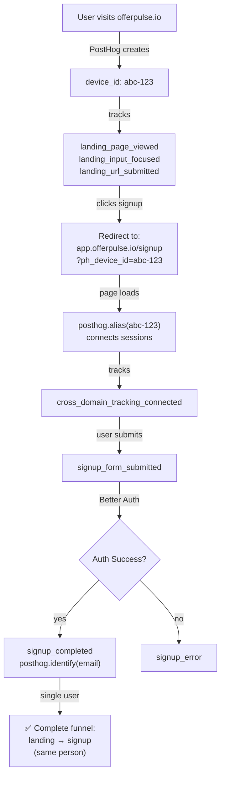

# PostHog Tracking Fix - Implementation Summary

**Date:** February 18, 2026  
**Status:** ✅ Complete - Ready for Testing

## What Was Fixed

### 1. Removed Fake Signup Tracking ✅

**Problem:** Marketing app mock auth pages were tracking fake `signup_completed` events

**Solution:** Converted mock pages to simple redirects

**Files changed:**
- `apps/marketing/app/auth/sign-up/page.tsx` - Now redirects to real signup
- `apps/marketing/app/auth/sign-in/page.tsx` - Now redirects to real login

### 2. Added Real Signup Tracking ✅

**Problem:** Dashboard app real auth pages had NO PostHog tracking

**Solution:** Added comprehensive tracking to real auth pages

**Files changed:**
- `apps/app/app/(auth)/signup/page.tsx` - Added real signup tracking + identify()
- `apps/app/app/(auth)/login/page.tsx` - Added real login tracking + identify()

**New events tracked:**
- `signup_form_submitted` - When user submits signup form
- `signup_completed` - After successful Better Auth signup
- `signup_error` - If signup fails
- `signin_form_submitted` - When user submits login form
- `signin_completed` - After successful Better Auth login
- `signin_error` - If login fails

### 3. Implemented Cross-Domain Tracking ✅

**Problem:** Users navigating from offerpulse.io → app.offerpulse.io were tracked as different users, breaking funnels

**Solution:** Pass PostHog device ID via URL and alias sessions

**Files changed:**
- `packages/lib/routing.ts` - Updated `buildAppSignupUrl()` and `buildAppLoginUrl()` to pass `ph_device_id`
- `apps/app/app/(auth)/signup/page.tsx` - Added alias logic to connect sessions
- `apps/app/app/(auth)/login/page.tsx` - Added alias logic to connect sessions

**How it works:**
1. User visits landing page on offerpulse.io → PostHog creates device_id
2. User clicks signup → URL includes `?ph_device_id=abc-123`
3. Dashboard app calls `posthog.alias(abc-123)` to merge sessions
4. All events (landing + signup) attributed to same user
5. After signup, user identified with email

### 4. Updated Marketing Links ✅

**Problem:** Some CTAs still linked to mock auth pages

**Solution:** Updated to use cross-app routing utilities

**Files changed:**
- `apps/marketing/app/(marketing)/page.tsx` - Updated signup CTA to use `buildAppSignupUrl()`

## Complete User Journey Flow



## Testing Instructions

### Quick Test (5 minutes)

1. **Start both apps:**
   ```bash
   pnpm dev
   ```

2. **Test cross-domain flow:**
   - Visit http://localhost:3000
   - Console: `posthog.get_distinct_id()` - record this ID
   - Submit competitor URL on landing page
   - Click "Start free trial"
   - Verify redirect URL contains `?ph_device_id=...`
   - Complete signup form
   - Check PostHog for events

3. **Verify in PostHog:**
   - Filter: `$environment = dev`
   - Find your test user by email
   - Verify events from both domains appear

### Full Testing Guide

See `POSTHOG_TESTING_GUIDE.md` for comprehensive testing steps, debugging, and verification checklist.

## Deployment Steps

### 1. Set Environment Variables in Vercel

**Both projects need these variables for Production:**

```bash
NEXT_PUBLIC_POSTHOG_KEY=phc_1TA8mL9rtySeLmQDx3KFUOz7Fh8QmBCdzuYVvFaT93W
NEXT_PUBLIC_POSTHOG_HOST=https://eu.i.posthog.com
NEXT_PUBLIC_ENVIRONMENT=prd
NEXT_PUBLIC_DASHBOARD_APP_URL=https://app.offerpulse.io
NEXT_PUBLIC_MARKETING_APP_URL=https://www.offerpulse.io
```

Set these in:
- https://vercel.com/omnicentra/offerpulse-marketing/settings/environment-variables
- https://vercel.com/omnicentra/offerpulse-app/settings/environment-variables

### 2. Commit and Deploy

```bash
# Review changes
git status
git diff

# Commit
git add .
git commit -m "fix: implement real PostHog tracking with cross-domain support

- Remove fake tracking from marketing mock auth pages
- Add real tracking to dashboard app auth pages
- Implement cross-domain tracking with device ID aliasing
- Convert mock auth pages to redirects
- Update landing page to use cross-app signup URL

This fixes:
- Fake signup/login events polluting analytics
- Broken funnels due to cross-domain tracking
- Inaccurate conversion metrics
"

# Push to deploy
git push origin main
```

### 3. Verify After Deployment

Wait for deployments to complete, then:

1. **Test production flow:**
   - Visit https://www.offerpulse.io
   - Complete user journey to signup
   - Verify events in PostHog (filter: `$environment = prd`)

2. **Check funnels:**
   - Landing Page Conversion Funnel: https://eu.posthog.com/project/127268/dashboard/526943
   - Analytics basics: https://eu.posthog.com/project/127268/dashboard/525618

3. **Monitor for issues:**
   - Check for console errors
   - Verify conversion rates are realistic
   - Ensure no fake signup events appear

## Expected Impact

### Before Fix
- Conversion rate: 40-60% (artificially high from fake data)
- Funnel: Broken (cross-domain tracking missing)
- User attribution: Wrong (fake users identified)
- Data quality: Poor (mix of real and fake events)

### After Fix
- Conversion rate: 2-5% (realistic for SaaS landing pages)
- Funnel: Complete (cross-domain tracking working)
- User attribution: Correct (real Better Auth users)
- Data quality: High (only real signups tracked)

## Key Metrics to Watch

### Immediate (First 24 Hours)

- `cross_domain_tracking_connected` events appearing
- `signup_completed` with `source: "dashboard_app"`
- No fake signup events from marketing app
- Person profiles showing events from both domains

### Short-term (First Week)

- Funnel conversion stabilizing at realistic rates
- No errors in browser console
- Cross-domain tracking success rate > 95%
- User identification working correctly

### Long-term (Ongoing)

- Conversion rate trends (should be stable)
- Attribution working for marketing campaigns
- Complete user journey visible in PostHog
- Data quality remains high

## Troubleshooting Quick Reference

| Issue | Quick Fix |
|-------|-----------|
| Device ID not passed | Check PostHog initialized on marketing site |
| Alias not working | Verify `ph_device_id` in URL, check console for errors |
| Events as different users | Check `cross_domain_tracking_connected` event exists |
| No events appearing | Verify env vars set in Vercel, redeploy |
| TypeScript errors | Run `pnpm install`, check posthog-js installed |
| Redirect loop | Check `NEXT_PUBLIC_DASHBOARD_APP_URL` set correctly |

See `POSTHOG_TESTING_GUIDE.md` for detailed debugging steps.

## Documentation Reference

- `POSTHOG_TRACKING_AUDIT.md` - Initial audit and problem analysis
- `POSTHOG_PRODUCTION_SETUP.md` - Vercel environment variable setup
- `POSTHOG_TESTING_GUIDE.md` - Comprehensive testing and debugging
- `POSTHOG_FIX_SUMMARY.md` - This summary (executive overview)

## Success!

All code changes are complete. The implementation is ready for testing.

**Next steps:**
1. Test locally (see POSTHOG_TESTING_GUIDE.md)
2. Set environment variables in Vercel
3. Deploy to production
4. Verify funnels working correctly

**Expected outcome:**
- Accurate conversion tracking
- Complete user journey visibility
- Real signups properly attributed
- Cross-domain funnels working perfectly
